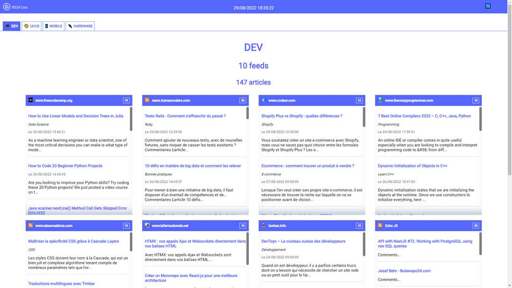
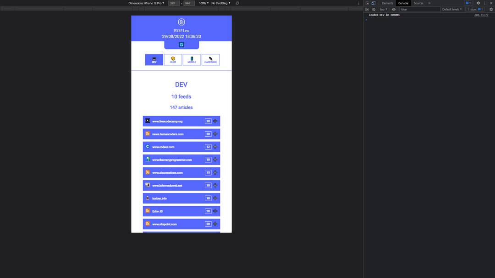

# [RSSFlex](https://rssflex.netlify.com)

## My favorites RSS feeds in one simple dashboard

 

 

## Previews

 

 

 

## Features

Read my favorites RSS feeds

 

## Stack

- React
- rss-parser

 

## TODO

- CRUD
- Account management
- RSS feeds management
- Theme customisation

 

Feel free to fork the project and add features.
